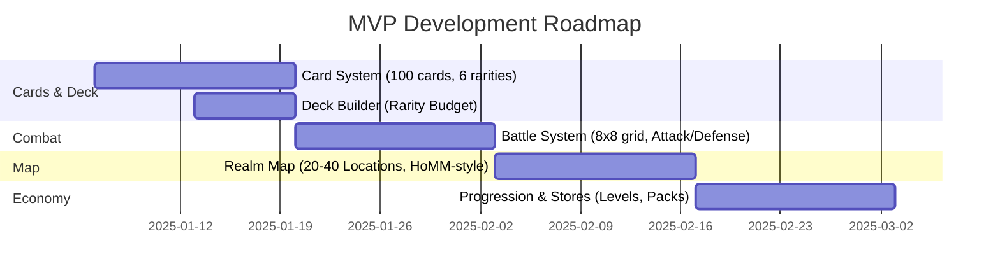
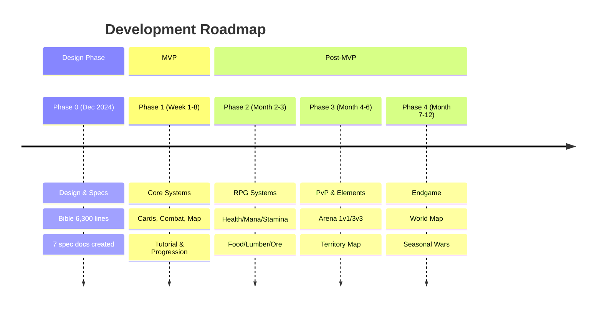

# 🎮 Sovereign Territories


> **"Build the Deck. Conquer the Campaign. Level Your Heroes."**

A multi-genre hybrid strategy game blending the best mechanics from:
- 🎴 **TCG Deck-Building** (Pokemon TCG, Magic: The Gathering) - Collect 100+ cards, 6 rarities, strategic deck construction
- 🗺️ **Territorial Conquest** (Risk, HoMM campaigns) - Alliance wars, map control, seasonal campaigns  
- ⚔️ **Party-Based Tactical Combat** (Baldur's Gate, HoMM) - Heroes with Health/Mana/Stamina, 8×8 grid battles, formations
- 🎲 **Tabletop Wargaming** (Warhammer) - 3D hero figurines on maps, visual unit stacks
- 🔄 **Roguelike Replayability** (Diablo, Slay the Spire) - Procedurally generated maps, endless runs
- 💰 **AFK Progression** (Idle games) - Passive income, auto-battle, come-back rewards

**What is the VISION**: We're building Pokemon TCG meets Slay the Spire meets Baldur's Gate, not Clash of Clans. Territory Maps are the endgame vision (Phase 3), but the MVP is all about validating the core loop: card collection + deck-building + tactical campaign battles.

**What We AVOID**: Forced resource collection, tedious base building, repetitive unit production, tap-tap-tap grind mechanics.

**What We EMBRACE**: Opening packs, collecting cards, leveling heroes, deck strategy, PvE campaigns, battle tactics—the **fun** parts of gaming!

---

## 📊 Project Status

| Phase | Status | Timeline | Progress |
|-------|--------|----------|----------|
| **Design & Specs** | 🟢 Complete | Dec 2024 | 100% |
| **MVP Development** | 🔵 Ready | 8 Weeks | 0% |
| **Phase 2 (RPG)** | 🟡 Planned | Month 2-3 | 0% |
| **Phase 3 (PvP)** | 🟡 Planned | Month 4-6 | 0% |
| **Phase 4 (Endgame)** | 🔴 Concept | Month 7-12 | 0% |

**Recent Updates** (Dec 30, 2024):
- ✅ **Phase 6 Complete**: Condensed Bible Sections 4 & 8 (~700 lines removed)
- ✅ Created [gameplay-modes-spec.md](docs/gameplay-modes-spec.md) (350+ lines, 8 modes)
- ✅ Added 75+ inline TODOs to specs (design decisions marked)
- ✅ Created [docs/README.md](docs/README.md) - Comprehensive documentation hub
- ✅ Moved working docs to [docs/working/](docs/working/) directory
- 📊 **Bible**: 6,300 lines (down from 6,807, target <6,000)

---

## 🚀 Quick Start

### For Game Designers
1. 📖 Read [docs/game-bible.md](docs/game-bible.md) - Complete game vision (~6,300 lines)
2. 🎯 Review [docs/mvp-scope-final.md](docs/mvp-scope-final.md) - 8-week roadmap
3. 🎓 Check [docs/tutorial-flow.md](docs/tutorial-flow.md) - Player onboarding (28 steps)

### For Developers
1. 🔧 Read [docs/combat-calculation-spec.md](docs/combat-calculation-spec.md) - Battle formulas
2. 💰 Review [docs/economy-system.md](docs/economy-system.md) - Currency balance
3. 🗺️ Check [docs/map-tier-progression.md](docs/map-tier-progression.md) - Map hierarchy

### For Visual Designers
1. 🎨 Read [docs/assets.md](docs/assets.md) - Art style guide, asset lists
2. 📐 Review MVP card templates (100 cards, 6 rarities)
3. 🖼️ Check UI mockup priorities (Deck Builder, Battle Grid, Realm Map)

**👉 Full documentation index**: [docs/README.md](docs/README.md)

---

## 📦 Repository Structure

```
soverign-territories/
├── docs/                          # 📚 All documentation
│   ├── README.md                  # Documentation hub (you are here)
│   ├── game-bible.md              # Master design doc (~6,300 lines)
│   ├── mvp-scope-final.md         # 8-week MVP roadmap
│   ├── tutorial-flow.md           # 28-step onboarding
│   ├── combat-calculation-spec.md # Battle formulas
│   ├── economy-system.md          # Currency balance
│   ├── gameplay-modes-spec.md     # 8 gameplay modes
│   ├── map-tier-progression.md    # Map hierarchy
│   ├── rpg-systems-spec.md        # Phase 2/3 mechanics
│   ├── terminology-guide.md       # Canonical naming
│   ├── assets.md                  # Art style guide
│   ├── specs/                     # JSON schemas
│   │   ├── card-schema.json
│   │   ├── pack-schema.json
│   │   ├── tactic-schema.json
│   │   └── equipment-schema.json
│   └── working/                   # Transient planning docs
│       ├── reorganization-status.md
│       └── bible-reorganization-plan.md
├── src/                           # 🎮 Unity project (to be created)
├── server/                        # 🖥️ Nakama server config (planned)
└── .github/                       # 🤖 GitHub Actions, agents
    ├── copilot-instructions.md
    └── agents/
```

---

## 🎯 MVP Scope (8 Weeks)



### ✅ Must Have (MVP)
- 🎴 **Card System**: 100 cards, 6 rarities (Common → Mythic), 6 types (Hero, Unit, Building, Worker, Tactic, Equipment)
- 🃏 **Pack Opening**: Standard Packs (1,000 Gold), Element Boosters (2,000 Gold), Epic Boosters (5,000 Gold)
- 📋 **Deck Building**: 10-50 cards (scales with Player Level), Rarity Budget prevents all-Legendary decks
- ⚔️ **Battle System**: 8×8 tactical grid, Attack/Defense one-hit removal, 10% crit chance
- 🗺️ **Realm Map**: 20-40 Locations, HoMM-style exploration, 5-10 treasure nodes
- 🎓 **Tutorial**: 28 steps, 30-60 minutes, 31-card starter deck at completion
- 📈 **Progression**: Player Level 1-30, deck size scales (10 cards → 50 cards)
- 💰 **Currencies**: Gold (F2P, cannot buy), Gems (premium), Energy (stamina)
- 🏪 **Stores**: Pack Store only (Gold purchases)

### ❌ Won't Have (Post-MVP)

**Phase 2** (Month 2-3):
- 🍖 Food/Lumber/Ore economy
- 🏪 Resource Store
- 🏗️ Economy card deployment (AFK income buildings)
- 👥 Alliance system
- 📅 Daily/Weekly quests
- ❤️ RPG Card Stats (Health/Mana/Stamina)
- 🧪 Consumables (Potions/Scrolls)
- 🛒 RPG Shops (Alchemist/Scribe)

**Phase 3** (Month 4-6):
- 🗺️ Territory Map (50-100 Realms, Risk-style)
- 🌍 World Map (200-500 Territories, seasonal wars)
- 🏰 Occupation mechanics (garrison, decay timers)
- 🏆 PvP Arena (1v1/3v3, Elo matchmaking)
- 🔥 Elemental interactions (Fire/Water/Earth/Lightning)
- 🩸 Status effects (Burn/Freeze/Poison/Stun)
- ⚔️ Equipment System (sockets, Jewels, Runes)

---

## 💡 Core Design Pillars

| Pillar | Description | Impact |
|--------|-------------|--------|
| 🤝 **F2P Respect** | 80-90% content accessible without spending | Gold cannot be bought, Rarity Budget prevents whale dominance |
| ⚔️ **Opt-In PvP** | No forced raids, bracketed matchmaking | PvP unlocks at Level 15, can stay PvE indefinitely |
| ⏰ **AFK Progression** | Economy cards generate passive income (Phase 2) | 10-50 Food/hour while offline, no tap-to-collect |
| 🎴 **Collector Appeal** | 6 rarities, thematic decks, seasonal exclusives | Mythic cards (6★), shiny variants, element themes |
| 🧠 **Strategic Depth** | Deck building, formations, multi-hero armies | Rarity Budget, 8×8 tactical grid, element counter-play |

---

## 🛠️ Tech Stack

| Component | Technology | Purpose |
|-----------|------------|---------|
| **Engine** | Unity 2021+ LTS | Cross-platform (iOS/Android/PC) |
| **Language** | C# (.NET Standard 2.1) | Game logic, networking |
| **Server** | Nakama 3.x | Accounts, matchmaking, real-time PvP |
| **Database** | PostgreSQL | Player data, card collections |
| **Real-time** | WebSockets | Chat, live battles, alliance events |
| **Auth** | Nakama Accounts | Email, Google, Apple, Steam |
| **Platforms** | Mobile + PC (Steam) | Primary: Mobile, Secondary: PC |

**Art Style**:
- 🗺️ **Maps**: 2.5D isometric (Age of Empires, Civilization)
- ⚔️ **Battles**: 2D tactical grid (Fire Emblem, Advance Wars)
- 🎴 **Cards**: Painterly style (Hearthstone, Legends of Runeterra)

---

## 📊 Documentation Metrics

| Metric | Current | Target | Status |
|--------|---------|--------|--------|
| **Bible Lines** | 6,300 | <6,000 | 🟡 95% |
| **Specs Created** | 7 docs | 10 docs | 🟢 70% |
| **Inline TODOs** | 113+ | All gaps marked | 🟢 90% |
| **Schemas** | 4 JSON | 6 JSON | 🟡 67% |
| **Phases Complete** | Phase 6 | Phase 10 | 🟢 60% |

---

## 🎨 Visual Assets (To Be Created)

**Priority 1 (MVP Week 1-2)**:
- 🎴 100 card illustrations (Common → Mythic)
- 🖼️ UI mockups (Main Menu, Deck Builder, Battle Grid)
- 🎨 Card frame templates (6 rarities, 6 types)

**Priority 2 (MVP Week 3-4)**:
- 🗺️ Realm Map tileset (Forest, Mountain, Water, Plains)
- ⚔️ Battle Grid assets (8×8 hex/square tiles)
- 👤 Unit sprites (Heroes, Units, placeholder art)

**Priority 3 (MVP Week 5-6)**:
- 🏪 Store UI (Pack opening animation, card reveal)
- 📊 Progression UI (Player Level, XP bar, reward screens)
- 🎓 Tutorial tooltips (28 steps, highlight boxes)

**See [docs/assets.md](docs/assets.md)** for complete asset list and style guide.

---

## 📈 Roadmap



| Phase | Timeline | Focus | Key Features |
|-------|----------|-------|--------------|
| **MVP** | 8 weeks | Core loop | Cards, Combat, Realm Map, Tutorial |
| **Phase 2** | Month 2-3 | RPG depth | Health/Mana, Consumables, Resources |
| **Phase 3** | Month 4-6 | PvP | Arena, Territory Map, Elements |
| **Phase 4** | Month 7-12 | Endgame | World Map, Expeditions, Seasons |

---

##  Contributing

This is currently a **solo design project**. Documentation is actively maintained and updated weekly.

**For questions or collaboration**:
-  Create a GitHub Issue
-  Discuss in GitHub Discussions
-  Fork and submit Pull Requests (docs improvements welcome)

---

## 🎮 Inspirations & Credits

Sovereign Territories stands on the shoulders of giants. This game is a love letter to decades of gaming across multiple genres:

### Core Mechanical Influences
- **TCG/CCG**: Pokemon TCG, Magic: The Gathering (deck building, rarity systems, card collection)
- **Party-Based RPGs**: Baldur's Gate, Neverwinter Nights, Diablo (hero attributes: Health/Mana/Stamina, equipment, leveling)
- **Tactical Strategy**: Heroes of Might and Magic III, Fire Emblem (grid-based combat, hero-led armies, formations)
- **Territorial Conquest**: Risk, Diplomacy (map control, alliances, conquest campaigns)
- **RTS**: Supreme Commander, Warcraft II, StarCraft (deck composition = army composition, no tedious production)
- **Tabletop Wargaming**: Warhammer 40K, Warhammer Fantasy (3D figurines on maps, visual unit representation)
- **Roguelikes**: Diablo, Slay the Spire (procedural maps, random encounters, replayability)
- **Idle/AFK**: AFK Arena, Idle Heroes (passive progression, auto-battle, offline rewards)
- **Mobile Strategy**: Clash Royale, Clash of Clans (quick battles, collection progression, F2P balance)

### Thematic Inspirations
- **Medieval Fantasy**: Lord of the Rings, D&D, Elder Scrolls
- **Norse Mythology**: God of War, Age of Mythology
- **Historical**: Total War series, Age of Empires
- **Sci-Fi**: StarCraft, Warhammer 40K
- **Board Games**: Risk, Settlers of Catan, Twilight Imperium (territory control, resource management)

### Design Philosophy
This game cherry-picks the **most enjoyable** mechanics from each genre while avoiding the **tedious grind**:
- ✅ **YES**: Card collecting, deck building, hero progression, strategic battles, map exploration
- ❌ **NO**: Forced resource gathering, repetitive base building, waiting for unit production, tap-to-collect mechanics

The goal: **Come back to open packs, level heroes, conquer maps, and enjoy strategic depth—not to babysit production queues.**

---

##  License

**Proprietary** - All rights reserved.

This is a personal game design project. All game mechanics, art concepts, and documentation are copyright of the project owner.

---

##  Additional Resources

-  **Full Documentation**: [docs/README.md](docs/README.md)
-  **Game Bible**: [docs/game-bible.md](docs/game-bible.md)
-  **MVP Roadmap**: [docs/mvp-scope-final.md](docs/mvp-scope-final.md)
-  **Asset Guide**: [docs/assets.md](docs/assets.md)
-  **Progress Tracking**: [docs/working/reorganization-status.md](docs/working/reorganization-status.md)

---

<div align="center">

**Last Updated**: December 30, 2024  
**Bible Status**: 6,300 lines (target <6,000)  
**Next Milestone**: Phase 7 (Condense Sections 2.6, 5, 9, 13)

Made with  for strategy game enthusiasts

</div>
