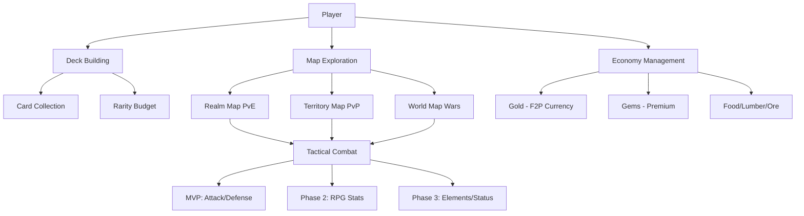
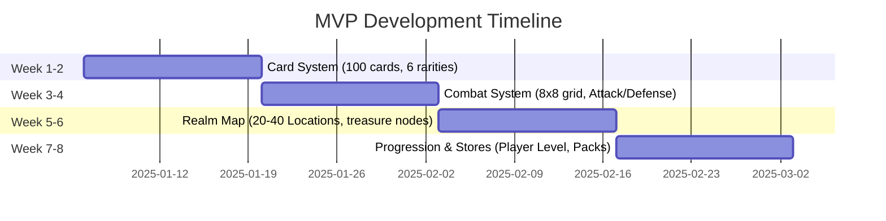

# 📚 Sovereign Territories Documentation

> **Tagline**: "Build the Deck. Rule the Map. Automate the Empire."

Welcome to the comprehensive documentation for **Sovereign Territories** - a hybrid strategy game merging Pokemon TCG deck-building, Risk-style conquest, and Heroes of Might and Magic tactical combat.

---

## 🎯 Quick Start

**New to the project?** Start here:
1. 📖 Read [game-bible.md](game-bible.md) - Master design document (~6,300 lines)
2. 🎮 Review [mvp-scope-final.md](mvp-scope-final.md) - 8-week implementation roadmap
3. 🎓 Walk through [tutorial-flow.md](tutorial-flow.md) - Player onboarding (28 steps)

---

## 📊 Documentation Status

**Last Major Update**: December 30, 2024 (Phase 6: Condensed Sections 4 & 8, Added 75+ inline TODOs)

---

## 📖 Core Documentation

### 🎮 Master Design
| Document | Purpose | Status | Lines |
|----------|---------|--------|-------|
| [game-bible.md](game-bible.md) | Complete game vision (MVP through Phase 4) | ✅ Active | ~6,300 |
| [terminology-guide.md](terminology-guide.md) | Canonical naming reference | ✅ Stable | ~200 |

**Key Bible Sections**:
- **Section 1**: Overview & Core Pillars (F2P fairness, opt-in PvP, AFK progression)
- **Section 2**: Card System (6 rarities, 6 types, Rarity Budget deck constraints)
- **Section 4**: Gameplay Modes (8 modes from Realm Map PvE to World Map seasons)
- **Section 5**: Economy & Trading (Multi-currency system: Gold/Gems/Energy + Food/Lumber/Ore)
- **Section 8**: Combat Mechanics (MVP one-hit removal → Phase 2 RPG stats)
- **Section 9**: Progression (Player Level 1-30, Castle Level 1-15)

---

## 🔧 Implementation Specs

### Core Systems
| Spec | Covers | Phase | TODOs |
|------|--------|-------|-------|
| [combat-calculation-spec.md](combat-calculation-spec.md) | Battle formulas, damage, abilities | MVP + Phase 2/3 | 40+ |
| [economy-system.md](economy-system.md) | Currency earning/spending, F2P balance | MVP + Phase 2/3 | 15+ |
| [rpg-systems-spec.md](rpg-systems-spec.md) | Health/Mana, Consumables, Equipment | Phase 2/3 | 20+ |
| [map-tier-progression.md](map-tier-progression.md) | Map hierarchy (World → Battle) | MVP + Phase 2-4 | 10+ |

### Specialized Specs
| Spec | Covers | Phase | TODOs |
|------|--------|-------|-------|
| [gameplay-modes-spec.md](gameplay-modes-spec.md) | 8 gameplay modes (Realm Map → World Map) | MVP + Phase 2-4 | 20+ |
| [mvp-scope-final.md](mvp-scope-final.md) | 8-week roadmap, card tiers, tutorial | MVP | 5+ |
| [tutorial-flow.md](tutorial-flow.md) | 28-step onboarding, 31-card starter deck | MVP | 3+ |

**Total Inline TODOs**: 113+ design decisions marked for future work

---

## 🗺️ System Architecture

---

## 🎯 MVP Scope (8 Weeks)

**Must Have**:
- ✅ Card system (100 cards, Common → Mythic)
- ✅ Deck building (10-50 cards, Rarity Budget)
- ✅ Battle system (8×8 grid, one-hit removal)
- ✅ Realm Map (HoMM-style exploration)
- ✅ Tutorial (28 steps, 31 cards)
- ✅ Currencies (Gold/Gems/Energy only)

**Won't Have** (Post-MVP):
- ❌ Phase 2: Food/Lumber/Ore, RPG stats, Consumables
- ❌ Phase 3: Territory/World Maps, PvP Arena, Elements

---

## 📦 Data Schemas (JSON)

Located in `specs/` directory:
- [card-schema.json](specs/card-schema.json) - Card data structure
- [pack-schema.json](specs/pack-schema.json) - Pack opening mechanics
- [tactic-schema.json](specs/tactic-schema.json) - Tactic card abilities
- [equipment-schema.json](specs/equipment-schema.json) - Equipment stats/sockets

---

## 🚧 Work-in-Progress

Located in `working/` directory (transient planning docs):
- [reorganization-status.md](working/reorganization-status.md) - Phase 1-6 tracking, remaining work
- [bible-reorganization-plan.md](working/bible-reorganization-plan.md) - Historical gap analysis

---

## 🎨 Visual Design Notes

### Art Style
- **Maps**: 2.5D isometric (like Age of Empires, Civilization)
- **Battles**: 2D tactical grid (like Fire Emblem, Advance Wars)
- **Cards**: Painterly style (like Hearthstone, Legends of Runeterra)
- **UI**: Dark theme with gold accents (medieval/fantasy aesthetic)

### Icon Conventions
- 🎴 Cards
- ⚔️ Combat
- 🗺️ Map
- 💰 Gold
- 💎 Gems
- ⚡ Energy
- 🍖 Food
- 🪵 Lumber
- ⚒️ Ore
- 🏆 PvP Arena
- 🏰 Castle
- 👥 Alliance

---

## 🔄 Phasing Summary

| Phase | Timeline | Focus | Status |
|-------|----------|-------|--------|
| **MVP** | Week 1-8 | Core loop (cards, combat, map) | 🔵 Design Complete |
| **Phase 2** | Month 2-3 | RPG systems (Health/Mana, Resources) | 🟡 Specs Created |
| **Phase 3** | Month 4-6 | PvP (Arena, Territory Map, Elements) | 🟡 Specs Created |
| **Phase 4** | Month 7-12 | Endgame (World Map, Expeditions, Seasons) | 🔴 Planning |

---

## 📝 Terminology Quick Reference

**Map Tiers** (smallest to largest):
1. **Battle Map** (8×8 grid) - Tactical combat arena
2. **Realm Map** (20-40 Locations) - HoMM-style exploration
3. **Territory Map** (50-100 Realms) - Risk-style conquest (Phase 3)
4. **World Map** (200-500 Territories) - Seasonal alliance wars (Phase 4)

**Player Title**: "Sovereign" (not King, Lord, General - gender-neutral)

**Currency Names**:
- **Gold** - Soft currency (F2P, cannot buy)
- **Gems** - Premium currency (whale advantage)
- **Energy** - Stamina system (time-gated)
- **Food/Lumber/Ore** - Resource currencies (Phase 2)

---

## 🛠️ Tech Stack

- **Engine**: Unity 2021+ LTS
- **Language**: C# (.NET Standard 2.1)
- **Server**: Nakama 3.x (PostgreSQL, WebSockets)
- **Platforms**: Mobile (iOS/Android) + PC (Steam)

---

## 🎯 Design Pillars

1. **F2P Respect**: 80-90% content accessible without spending
2. **Opt-In PvP**: No forced raids, bracketed matchmaking, anti-griefing
3. **AFK Progression**: Economy cards generate passive income (Phase 2)
4. **Collector Appeal**: 6 rarities, thematic decks, seasonal exclusives
5. **Strategic Depth**: Deck building, formations, multi-hero armies

---

## 📊 Current Metrics

**Game Bible**:
- **Current**: ~6,300 lines (down from 6,807)
- **Target**: <6,000 lines
- **Reduction**: ~500 lines condensed (Phase 6)

**Spec Coverage**:
- **Created**: 7 spec documents (~3,700 lines)
- **Inline TODOs**: 113+ design decisions marked
- **Schemas**: 4 JSON data templates

**Reorganization Progress**:
- ✅ Phase 1-6 Complete (Sections 2.5, 4, 5.5, 8 condensed)
- ⏳ Phase 7 Pending (Sections 2.6, 5, 9, 13)

---

## 📚 Reading Paths

### For Designers
1. [game-bible.md](game-bible.md) - Full vision
2. [gameplay-modes-spec.md](gameplay-modes-spec.md) - 8 gameplay modes
3. [economy-system.md](economy-system.md) - F2P balance

### For Developers
1. [mvp-scope-final.md](mvp-scope-final.md) - 8-week roadmap
2. [combat-calculation-spec.md](combat-calculation-spec.md) - Battle formulas
3. [rpg-systems-spec.md](rpg-systems-spec.md) - RPG mechanics

### For Players (Marketing)
1. [tutorial-flow.md](tutorial-flow.md) - Onboarding experience
2. [game-bible.md](game-bible.md) Section 1 - Core Pillars
3. [terminology-guide.md](terminology-guide.md) - Game lexicon

---

## 🤝 Contributing

This is currently a solo design project. Documentation is actively maintained and updated weekly.

**For questions or collaboration**: Contact project owner via GitHub Issues.

---

## 📄 License

Proprietary - All rights reserved.

---

**Last Updated**: December 30, 2024  
**Next Review**: Phase 7 (Condense Sections 2.6, 5, 9, 13)
