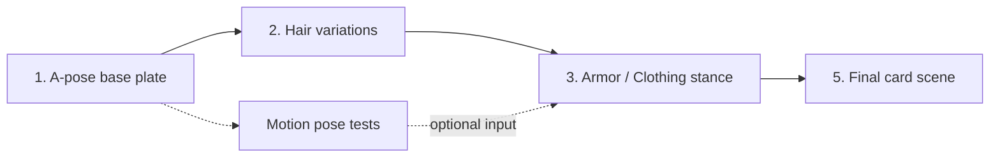

# ComfyUI Art Pipeline — Hero Card Art

**Status:** Living document · **Scope:** How we generate Sovereign Dawn hero card art
**Owner:** Draknare Thorne · **Last updated:** 2026-10-02 (paths/status refreshed against `data/art/README.md`, which is now the day-to-day authoritative reference — update there first)

This describes *how we manage* the art-generation process — the stages, what each one
produces, and how images are hand-carried from one workflow to the next. It is a
**manual, staged Qwen image-to-image pipeline**, not an automated one. Node wiring is
intentionally out of scope here; the workflow `.json` files are the source of truth for that.

---

## 1. Tech stack (brief)

- **Model:** Qwen-Image-Edit (2511) running as an **image-to-image / image-edit** flow —
  every workflow takes **one input image** plus a prompt and edits it.
- **Speed toggle:** an optional 4-step Lightning LoRA for fast drafts; off = slower/higher-fidelity.
- **Tooling:** ComfyUI, driven by hand. There is **no auto-chaining** between workflows yet —
  the artist selects the best output of one stage and loads it as the input to the next.

---

## 2. Where things live

> **Structure reference:** [`data/art/README.md`](../../data/art/README.md) is the authoritative
> explanation of how `data/art/` is organized (definitions vs. assembly layers, categories, groups,
> sets). Read that before adding a new hero/component/set folder — the table below will be updated
> to match once the current reorg lands.

| Location | Purpose |
| --- | --- |
| `workflows/<Hero>/` | **The real work.** ComfyUI workflow exports, one per experiment. Named `<Hero>_Qwen_<Category>_<Variant>.json` (e.g. `Drakness_Qwen_Armor_Elegant.json`). |
| `data/art/_templates/<archetype>/*.txt` | **Canonical prompt templates** (Pose, Head, Hair, Motion, Armor, Clothing, Scene) — `{{TOKEN}}` placeholders filled by `tools/generators/gen_prompt.py`. `heroes/` is the humanoid archetype; `dragons/` is the Elder Dragon archetype (text-to-image). See [`prompt-pattern.md`](prompt-pattern.md) for block order/wording conventions. |
| `data/art/heroes/`, `data/art/races/`, `data/art/wardrobe/`, `data/art/motion/`, `data/art/dragons/`, `data/art/backgrounds/` | **Generator source of truth** — hero/dragon identities, reusable hair/motion/wardrobe pieces, backgrounds. |
| `data/art/_sets/<group>/<slug>/<stage>/*.json` | **Assembly cards** — glue a hero/dragon + component(s) + template together. One folder per roster group (`drakn-sisters`, `drakn-bound`, `elder-dragons`, `angel-primes`). |
| `prompts/<group>/<Hero>/<stage>/<family>/*.txt` | **Generated, production-ready prompts** — copy straight into the matching ComfyUI workflow. Regenerate via `gen_prompt.py`; never hand-edit. |
| `prompts/_archive/` | **Historical reference only** — the old `[BRACKETS]`/hand-copied template system and the original hand-crafted Drakness prompts. No longer live. |
| `data/cards/sovereign-dawn/heroes/<hero>.json` | **Canon source** — name, element, class, archetype, race, sex, companion, lore, plus `art.artIdentity` linking to the art identity. Created FIRST; the art is built for the card. |
| `data/art/heroes/<group>/<slug>.json`, `data/art/dragons/**` | **Art identity** — palette/physique (heroes) or description (dragons). Links back to its card by `cardId` and pulls name/element/sex from it. Owns the look; the card owns the mechanics. |
| `assets/examples/` | Reference/example images. |

Workflow **categories** (from the file names): `X_Pose` / `A_*` (base pose), `Hair`,
`Armor`, `Clothing`, `Motion`, plus `_Head` closeups and `_Stance` / `_Pose` variants.

---

## 3. The staged pipeline

Each stage is a separate workflow (or set of workflows). Output images are reviewed, the best
one is chosen, and it becomes the **input image** for the next stage. Later stages lean more on
the input image and less on prompt text.



| # | Stage | Input | Produces | Prompt emphasis |
| --- | --- | --- | --- | --- |
| 1 | **A-pose base plate** | reference image / face | Clean full-body A-pose on a plain studio backdrop — locks face likeness, body, proportions. | Full description: body, skin, eyes, base look. |
| 2 | **Hair variations** | chosen A-pose | A series of hairstyle options on the same base pose. | Hair cut/volume/flow; everything else held from input. |
| 3 | **Armor / Clothing stance** | chosen A-pose + hair | Character in an armor set or outfit, usually walking or in a stance. | Outfit/armor design + stance; face/hair carried from input. |
| 4 | **Motion pose tests** | chosen A-pose (or hair) | A library of motion/pose options to try out. May feed into stage 3 to lock a specific stance. | Movement/pose only. |
| 5 | **Final card scene** | an "almost-perfect" image (chosen stance + outfit + hair) | The finished card illustration. | **Minimal.** Tell it to follow the input image closely; focus prompt on **background, final stance touches, spell, and weapon placement** — do *not* re-describe hair/armor. |

**Key principle:** push detail *upstream*. By the final scene the input image already carries
face, hair, and outfit, so the final prompt only adds the scene (background), the spell/VFX,
the weapon, and small stance corrections.

**Prompt rule:** only **re-describe what should change** from the input image. Everything you
don't mention is meant to carry through. Prompts repeat a lot across stages on purpose — that
repetition holds the look steady while one thing changes.

---

## 4. Final card scene — definition checklist

For each hero, lock these before building the final-scene workflow. Pull palette and
identity straight from the hero's card JSON (`class`, `archetype`, `element`, `companion`) and the
linked art identity (`palette`, `physique`).

- **Armor / outfit** — the canonical "intro" look (one chosen set, not an experiment).
- **Weapon** — type, material, where it sits / how it's held.
- **Spell / VFX** — the signature effect, tied to element and class.
- **Stance** — final body pose and camera framing.
- **Background** — environment + atmosphere/haze, on-palette.
- **Palette** — primary + accent + eye color from the hero's art identity `palette`.
- **Companion (optional)** — whether the bonded pet appears / is hinted (see `pairing`).

> Example canon anchor — **SD-001 Drakness Thorne**: Darkness element · Necromancer ·
> Summoner/Spawner · companion **Umbrath** · palette **Midnight Violet** + Vibrant Amethyst /
> Polished Silver, deep-violet iris. Intro scene TBD (armor / weapon / spell / stance /
> background to be locked).

---

## 5. Model strategy (per stage)

We keep a benchmark harness of single-image A-pose workflows (one per model) under
`workflows/Experimental/` — same pose prompt, different model — to compare **speed vs output
quality** before committing a model to a stage.

### Two latent "families" (this drives everything)

- **Qwen family** — the current `Qwen-Image-Edit` **and `FireRed`** share the *same* text
  encoder (`qwen_2.5_vl`) and the *same* VAE (`qwen_image_vae`); FireRed only swaps the
  transformer. So **FireRed is a higher-fidelity sibling of Qwen in the same latent space** —
  Qwen → FireRed causes **minimal identity/colour drift.**
- **Flux family** — Flux.1 / Flux.2 use different encoders (T5 / Mistral) and different VAEs.
  Higher quality ceiling, but they **reinterpret** the image more → more drift from the Qwen look.
  Treat a Flux final as a deliberate *re-render* and hold likeness with a character LoRA/reference.

### Recommended model per stage

| Stage | Job | Model | Why |
| --- | --- | --- | --- |
| 1–4 Exploration | Volume + speed | **Qwen 4-step** (current) | ~1–2 min; most outputs discarded. |
| 5 Final — stay on-model | Quality, low drift | **FireRed 1.1** (8-step) | Shares Qwen VAE+encoder → upgrades fidelity, keeps her *her*. |
| 5 Final — max quality | Highest ceiling | **Flux.2 dev** (Turbo, ~20 steps) | Best of the Flux set; deliberate re-render. |
| 6 Polish | Skin / texture / eyes / light | **Flux.2 Polish** | Dedicated finishing pass (subsurface, 85mm). |
| Future: swap weapon/armor region | Inpaint | **Flux.1 Fill dev** | Fill/inpaint model for the multi-image plan. |
| — | — | **JoyAI** deprioritised | int8 everywhere + 40 steps, no LoRA → slower *and* a quality compromise. |

### Denoise is the key lever

All current workflows run **denoise = 1.0** (full redraw), which is why the look drifts between
stages. Tune it by intent:

- **"Change one thing" stages** (hair → armor → stance): **~0.4–0.7** — change the target, hold the rest.
- **Polish pass**: **~0.2–0.4** — enhance texture without redrawing identity.
- **Base A-pose**: **1.0** — a full generation is wanted here.

**Where to start within a range: start low, climb.** Lower denoise preserves identity, so begin at
the bottom and raise by ~0.05 only if the change isn't fully taking. Defaults: hair **0.45**, armor/outfit
**0.55**, final/FireRed polish **0.6**. The first value that fully applies the change is the right one —
every extra step past that just erodes face, eyes, and body.

> **Tip:** `denoise` isn't exposed outside the subgraph by default. Open the subgraph, select the
> KSampler, and **promote** the `denoise` (and ideally `steps` + `seed`) widget to the parent so it's
> editable on the outer node per-run. Do it once per ST workflow and save.

### Steps: Turbo (4) vs non-Turbo (40)

**Steps = how many refinement passes the sampler takes** to turn noise into a finished image. More
passes = more chances to sharpen and converge. The catch: steps are **matched to the Lightning/Turbo
LoRA**, a distilled shortcut trained to finish in ~4 passes.

- **4-step Turbo (Lightning LoRA on):** ~10× faster (big on an 8 GB 3050), clean output, very stable
  per seed, slightly softer micro-detail. **Use for all iteration** — A-pose, hair, armor, stance.
- **40-step non-Turbo (LoRA off):** slower, slightly finer skin/fabric texture *if* tuned, more
  variation. **Use only for the final hero render** (why `ST_FireRed_Final` / `ST_Flux_Final` exist).
- **Don't mix them:** 4 steps *without* Lightning = blurry/unfinished; 40 steps *with* Lightning =
  burnt/oversaturated.

Steps interact with denoise: **effective work ≈ steps × denoise.** At 0.55 denoise, 4 steps do ~2
steps' worth of repaint — which is exactly why the Lightning LoRA matters at these low-denoise edits.
Drop the LoRA and you'd have to push steps up to compensate.

### Image size & scaling (why you never set an output size)

In the Qwen-Image-Edit 2511 workflow you **don't** specify an output size — and you don't need a
separate scale node. Every Qwen edit workflow (A-pose, Edit, Polish, and all the Drakness files)
contains a **`FluxKontextImageScale`** node that automatically snaps the incoming image to the
nearest supported Qwen resolution bucket (~1 megapixel, standard aspect ratios). Flow:

1. **Load image** → `FluxKontextImageScale` conforms it to a ~1 MP bucket.
2. `VAEEncode` → latent at that size → `KSampler` denoises at that size → `VAEDecode`.
3. **Output = that bucket size.** Feed it into the next stage and it's already a bucket size, so it
   passes through unchanged → **size stays stable across the whole chain.**

**The snap crops.** `FluxKontextImageScale` picks the bucket whose aspect ratio is closest to the input, resizes with
Lanczos to cover it, then **centre-crops** the overflow. A photo whose aspect is not exactly a bucket loses its
edges (a head or feet can be cut) and two photos of different aspect come out at different sizes. The list contains
**944x1104** (about 1.04 MP, multiples of 16), so an input that is already 944x1104 passes through untouched.

**Standard size (Oct 2026, provisional until the reset finishes): 944x1104.** Scale each original to fit and **pad** it
(never crop) to 944x1104 before the first X Pose, so every sister's chain starts and stays at one size. Other engines:

| Template | Scaling node | At a 944x1104 input |
| --- | --- | --- |
| Qwen edit (ST1 A Pose, ST2, ST4 Qwen Polish) | `FluxKontextImageScale` | unchanged (it is a bucket) |
| FireRed (ST3) | `ResizeImageMaskNode`, scale total pixels 1 MP, Lanczos | 944x1104 becomes 947x1107, then the VAE trims 1 px per edge back to 944x1104: right size, one needless resample. Other input sizes drift (1024x1280 ends at 912x1144). Prefer scaling by dimension 944x1104 with pad or crop off |
| Flux.2 (ST3 Flux, ST4 Flux Polish) | `ImageScaleToTotalPixels` 1 MP | same small resample; both sides are multiples of 16, so the size survives |

What this means in practice:

- The **one thing that sets the canvas is the size and aspect of the very first image** you feed the
  A-pose. Pad the originals to 944x1104 and every downstream stage inherits it.
- You **don't** need to add `ImageScaleToTotalPixels` to the Qwen workflow — it would be redundant with
  `FluxKontextImageScale` (and could fight the buckets). That node appears in the **Flux / MageFlow /
  FireRed** ST files precisely *because* those model families don't ship the Kontext scaler and need an
  explicit ~1 MP normalizer.
- `ST_Qwen_B_Pose` is the exception: it uses an **`EmptyLatentImage`** (text-to-image style), so there
  you *do* set width/height directly — it's a fresh generation, not an edit of an incoming image.

Scaling matters because the model runs best at its **trained resolution**: oversized inputs risk OOM on
8 GB and waste time; undersized inputs lose detail. The ~1 MP bucket is the sweet spot, and in your
Qwen workflow it's handled for you.

### Polish vs Final vs Upscale (they do different jobs)

These three are easy to conflate — they are **not** the same thing, and only one changes resolution:

| Step | Workflow(s) | What it does | Resolution |
|---|---|---|---|
| **Polish** | `ST_Qwen_Polish`, `ST_Flux_Polish` | Low-denoise diffusion pass to refine **skin / eyes / micro-detail** | still ~1 MP |
| **Final** | `ST_FireRed_Final`, `ST_Flux_Final` | Terminal **look / stylization** render — produces the approved image | still ~1 MP |
| **Upscale** | *(new — not built yet)* | **Enlarges pixels** via an ESRGAN model (no diffusion) | **raises resolution** |

So **Polish is not the upscaler**, and neither is Final — both work at ~1 MP. Upscaling is a **separate,
final step** you run *after* you've picked the keeper. You don't always run Polish *and* Final; a Final
pass often doubles as polish. Typical order:

```
edits (A-pose → hair → motion → armor → stance)   ~1 MP, iterate here
        └─► (optional) Polish                      ~1 MP, detail only
              └─► Final (FireRed or Flux)           ~1 MP, the approved image
                    └─► Upscale (ESRGAN)            enlarges → downscale to master → ship
```

### Upscaling: when & how (8 GB-safe)

**When:** once, at the very end, on the one approved card. Never during iteration — upscaling early just
runs every stage slower and gets redone next stage.

**Source sizes do matter (corrected Oct 2026).** The ~1 MP normalizer maps each photo to the bucket nearest its
aspect and centre-crops the rest, so mixed originals (1122×1402, 941×1254, 1170×1580…) end at different sizes and
lose edges. Scale each to fit and pad to 944×1104 before loading; do not crop.

**How, on an RTX 3050 8 GB — use ESRGAN, not a latent hi-res pass:**

| Method | What it is | 8 GB verdict |
|---|---|---|
| **ESRGAN model upscale** (`UpscaleModelLoader` → `ImageUpscaleWithModel`, e.g. 4x-UltraSharp) | small dedicated CNN, auto-tiles | ✅ light & safe — no diffusion model loads |
| **Latent hi-res-fix** (upscale latent → KSampler) | re-runs the full UNet at 2×+ | ⚠️ the OOM risk on Qwen/Flux fp8 |

**The upscale workflow (build this in ComfyUI as a standalone `ST_Upscale`):**

```
LoadImage → UpscaleModelLoader (4x-UltraSharp) → ImageUpscaleWithModel
          → ImageScale (downscale to target master, e.g. 1600×2368) → SaveImage
```

No checkpoint/UNet loads, so it barely touches VRAM — one of the most 8 GB-friendly graphs you can run.
"Upscale 4× then shrink to target" yields the crispest result.

> **⚠️ TODO — no upscaler exists yet.** None of the downloaded `workflows/Templates` include an upscale
> workflow, and no `ST_Upscale` has been built. **Before final art rendering**, either:
> 1. **Find one** — ComfyUI ships a built-in *Image → Upscale* example (Workflow ▸ Browse Templates), or
>    grab a community *Ultimate SD Upscale* / ESRGAN graph, **or**
> 2. **Build the `ST_Upscale` chain above** (LoadImage → UpscaleModelLoader → ImageUpscaleWithModel →
>    ImageScale → SaveImage).
>
> Either way you must **download an ESRGAN upscale model** (e.g. `4x-UltraSharp.pth`) into
> `ComfyUI/models/upscale_models/`. Revisit at the upscale stage — don't block iteration on it now.

**When it becomes a problem:** a non-tiled 4× of anything over ~1 MP can spike VRAM → drop to 2× or use a
**tiled** upscaler (Ultimate SD Upscale) to keep VRAM flat. A **latent hi-res pass at ≥2×** on Qwen/Flux
will likely OOM — if you want re-rendered detail, keep the bump small (1.3–1.5×) at low denoise (~0.25),
or skip it; ESRGAN is enough for card art.

### Mobile delivery spec (Sovereign Territories)

Plan every heroine against this so cards work full-screen, in the landscape split view, and as avatars:

- **Master aspect:** one portrait ratio for all heroes. The Qwen edit only outputs its **native buckets**,
  so pick one and stay on it: **2:3** (~800×1184) or **3:4** (~880×1184). **3:4 is the pragmatic default**
  — a clean native bucket close to card proportions. You **can't** get an exact 5:7 out of the Qwen edit;
  if you want a precise card aspect, enforce it at the **final crop/upscale**, not the source.
- **Standard working size is now 944×1104 (provisional).** It replaces the 2:3 / 3:4 advice above for the
  A-pose chain. Pad (do not crop) every source to it: the Kontext scaler centre-crops anything that is not
  an exact bucket, and mismatched source *aspects* are what make heroines come out different shapes.
- **Master resolution:** finish/upscale to a high-DPI master (**≥ 1600×2368**, more is fine), then let the
  app downscale per context. Keep the ~1 MP **working plate** separate from the **final master** — never
  ship the working plate for the detailed full-screen view.
- **Safe zone:** compose **face + upper body in the top ~60%**; treat the **bottom third as sacrificial**
  (legs/feet, fine to sit behind a stats/skills overlay). Small margins at all edges so crops never clip
  the face.
- **Avatars = dedicated headshots**, not crops of the body plate (use the `X_Head` stage) — full
  resolution and proper framing.
- **Keep art UI-free;** overlay stats/skills/spells at runtime.
- **Downscale-only is lossless-perceptually:** the landscape split view (card scaled down) is the easy
  case; the portrait full-screen view is what demands the high master resolution.

### Before investing deeper in one Qwen version

New **Qwen-Image-Edit 2511 / 2512** templates (and other unused templates) are worth a quick,
**timeboxed** bake-off on the A-pose harness *now* — switching the base model later means
regenerating work. Pick the version, then go deep; don't let template-shopping stall progress.

---

## 6. Current constraints & future direction

**Current (novice / single-image phase):**

- One input image + one prompt per workflow; outputs are hand-carried stage to stage to reach final.
- Single model family (Qwen image-edit) for now, to get **consistent output** through a repeatable
  manual end-to-end flow before adding variables.
- Running workflows out-of-order in the ComfyUI GUI — not yet wired into a single graph.

**Planned:**

- **Multi-image input** — feed separate reference images (e.g. a weapon, an armor set) into one
  scene once comfortable, instead of carrying everything in a single image.
- **Model comparisons** — ✅ benchmark harness in `workflows/Experimental/` (Qwen, FireRed, Flux.1,
  Flux.2, JoyAI) compares speed/quality on a shared A-pose; per-stage picks in §5. Next: run the
  newer Qwen 2511/2512 templates through the same harness.
- **GUI auto-wiring** — connect stages into fewer graphs as ComfyUI familiarity grows.

## 7. Status & open questions

- ✅ Drakness has extensive experiments across pose, hair, armor, clothing, and motion.
- ✅ Model benchmark harness assembled (`workflows/Experimental/`).
- ⬜ **Decide the base Qwen version** — bake off Image-Edit 2511 vs 2512 (+ unused templates) before going deeper.
- ⬜ **Missing:** the locked "intro" definition for SD-001 (armor, weapon, spell, stance, background).
- ⬜ A repeatable **final-scene workflow** template that other heroes can reuse.
- ⬜ Convention for naming/storing **final** (approved) art vs experiments.

*(Next: review Drakness experiments together, decide the SD-001 intro scene, and note what
pieces are still missing from the workflow set before scaling to SD-002…SD-010.)*
