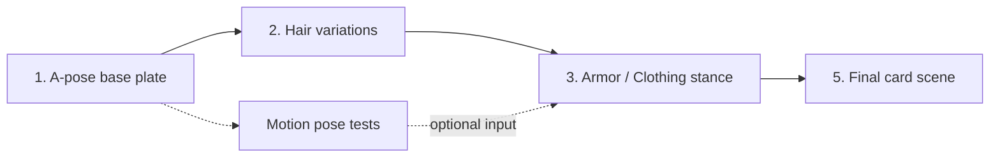

# ComfyUI Art Pipeline — Hero Card Art

**Status:** Living document · **Scope:** How we generate Sovereign Dawn hero card art
**Owner:** Draknare Thorne · **Last updated:** 2026-09-30

This describes *how we manage* the art-generation process — the stages, what each one
produces, and how images are hand-carried from one workflow to the next. It is a
**manual, staged Qwen image-to-image pipeline**, not an automated one. Node wiring is
intentionally out of scope here; the workflow `.json` files are the source of truth for that.

---

## 1. Tech stack (brief)

- **Model:** Qwen-Image-Edit (2511) running as an **image-to-image / image-edit** flow —
  every workflow takes **one input image** plus a prompt and edits it.
- **Speed toggle:** an optional 4-step Lightning LoRA for fast drafts; off = slower/higher-fidelity.
- **Tooling:** ComfyUI, driven by hand. There is **no auto-chaining** between workflows yet —
  the artist selects the best output of one stage and loads it as the input to the next.

---

## 2. Where things live

| Location | Purpose |
| --- | --- |
| `workflows/<Hero>/` | **The real work.** ComfyUI workflow exports, one per experiment. Named `<Hero>_Qwen_<Category>_<Variant>.json` (e.g. `Drakness_Qwen_Armor_Elegant.json`). |
| `prompts/` | **Ideation scratch only** — loose text notes for standard poses/palettes. Not the production prompts. |
| `data/cards/sovereign-dawn/heroes/<hero>.json` | **Canon source** — element, class, archetype, `art.palette` (primary/accent/eye), companion, lore. The art must stay on-theme with this. |
| `assets/examples/` | Reference/example images. |

Workflow **categories** (from the file names): `X_Pose` / `A_*` (base pose), `Hair`,
`Armor`, `Clothing`, `Motion`, plus `_Head` closeups and `_Stance` / `_Pose` variants.

---

## 3. The staged pipeline

Each stage is a separate workflow (or set of workflows). Output images are reviewed, the best
one is chosen, and it becomes the **input image** for the next stage. Later stages lean more on
the input image and less on prompt text.

| # | Stage | Input | Produces | Prompt emphasis |
| --- | --- | --- | --- | --- |
| 1 | **A-pose base plate** | reference image / face | Clean full-body A-pose on a plain studio backdrop — locks face likeness, body, proportions. | Full description: body, skin, eyes, base look. |
| 2 | **Hair variations** | chosen A-pose | A series of hairstyle options on the same base pose. | Hair cut/volume/flow; everything else held from input. |
| 3 | **Armor / Clothing stance** | chosen A-pose + hair | Character in an armor set or outfit, usually walking or in a stance. | Outfit/armor design + stance; face/hair carried from input. |
| 4 | **Motion pose tests** | chosen A-pose (or hair) | A library of motion/pose options to try out. May feed into stage 3 to lock a specific stance. | Movement/pose only. |
| 5 | **Final card scene** | an "almost-perfect" image (chosen stance + outfit + hair) | The finished card illustration. | **Minimal.** Tell it to follow the input image closely; focus prompt on **background, final stance touches, spell, and weapon placement** — do *not* re-describe hair/armor. |

**Key principle:** push detail *upstream*. By the final scene the input image already carries
face, hair, and outfit, so the final prompt only adds the scene (background), the spell/VFX,
the weapon, and small stance corrections.

**Prompt rule:** only **re-describe what should change** from the input image. Everything you
don't mention is meant to carry through. Prompts repeat a lot across stages on purpose — that
repetition holds the look steady while one thing changes.

---

## 4. Final card scene — definition checklist

For each hero, lock these before building the final-scene workflow. Pull palette and
identity straight from the hero's card JSON (`art.palette`, `class`, `archetype`, `element`, `companion`).

- **Armor / outfit** — the canonical "intro" look (one chosen set, not an experiment).
- **Weapon** — type, material, where it sits / how it's held.
- **Spell / VFX** — the signature effect, tied to element and class.
- **Stance** — final body pose and camera framing.
- **Background** — environment + atmosphere/haze, on-palette.
- **Palette** — primary + accent + eye color from the card's `art.palette`.
- **Companion (optional)** — whether the bonded pet appears / is hinted (see `pairing`).

> Example canon anchor — **SD-001 Drakness Thorne**: Darkness element · Necromancer ·
> Summoner/Spawner · companion **Umbrath** · palette **Midnight Violet** + Vibrant Amethyst /
> Polished Silver, deep-violet iris. Intro scene TBD (armor / weapon / spell / stance /
> background to be locked).

---

## 5. Current constraints & future direction

**Current (novice / single-image phase):**

- One input image + one prompt per workflow; outputs are hand-carried stage to stage to reach final.
- Single model family (Qwen image-edit) for now, to get **consistent output** through a repeatable
  manual end-to-end flow before adding variables.
- Running workflows out-of-order in the ComfyUI GUI — not yet wired into a single graph.

**Planned:**

- **Multi-image input** — feed separate reference images (e.g. a weapon, an armor set) into one
  scene once comfortable, instead of carrying everything in a single image.
- **Model comparisons** — run the same prompts through **Flux** and **FireRed** img2img (and other
  non-Qwen flows) to compare output; save those workflows under `workflows/<Hero>/` for reference.
- **GUI auto-wiring** — connect stages into fewer graphs as ComfyUI familiarity grows.

## 6. Status & open questions

- ✅ Drakness has extensive experiments across pose, hair, armor, clothing, and motion.
- ⬜ **Missing:** the locked "intro" definition for SD-001 (armor, weapon, spell, stance, background).
- ⬜ A repeatable **final-scene workflow** template that other heroes can reuse.
- ⬜ Convention for naming/storing **final** (approved) art vs experiments.

*(Next: review Drakness experiments together, decide the SD-001 intro scene, and note what
pieces are still missing from the workflow set before scaling to SD-002…SD-010.)*
