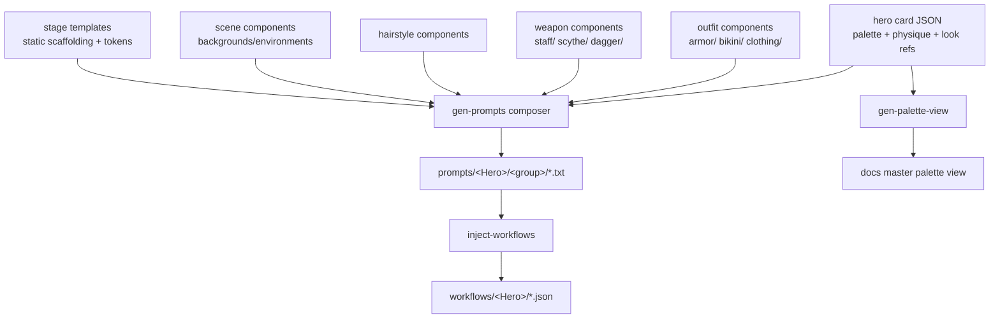

# Prompt Automation & Component System — Draft Proposal

> **Status: DRAFT / ideation.** Nothing here is built yet. This captures the long-term vision so
> our *manual* template and prompt edits move toward it instead of away from it. We keep working by
> hand (Drakness as the pilot) and implement in phases. The goal: **change one place, regenerate,
> and every affected prompt updates** — no hand-syncing, no missed spots.

## 1. Goal

Today a prompt's text is authored by hand and pasted into a ComfyUI workflow. Colours, fidelity
lines, lighting, outfits, and poses are all mixed into each `.txt`. That's fine for one hero, but it
does **not** scale to 30 cards and dozens of stages, and it drifts.

The target is a **single source of truth → generated outputs** pipeline, where the prompt is
*composed* from small reusable pieces:

- **Hero traits** (identity: palette, physique) — already in the card JSON.
- **Reusable components** (outfits, weapons, hairstyles, scenes, pets) — their own small JSON files.
- **Stage templates** — the static scaffolding (lighting, fidelity, photography lines) with explicit
  injection points.

A generator resolves `hero + components + template → prompt.txt → (later) ComfyUI .json`.

## 2. Guiding principles

- **Author once, generate many.** Static content (fidelity/lighting/photography lines) lives in
  *one* template; a change cascades to every prompt built from it.
- **Keep the hero card lean.** Heroes **reference** component IDs; they do **not** inline every
  outfit description. The card stays a game/identity artifact, not a prompt dump.
- **Components are hero-agnostic where possible.** Outfits/weapons use `[PRIMARY]`/`[ACCENT]` colour
  tokens so the *same* bone armor can be worn by Drakness (violet) or Draknora (flame red) — the
  generator fills the wearer's palette.
- **Deterministic & idempotent.** Generated files are never hand-edited; re-running the generator on
  unchanged inputs produces no diff.
- **Composable scripts + a master wrapper.** Each step is a small script you can run and verify
  alone; a wrapper chains them.

## 3. Architecture overview



## 4. Data model

### 4.1 Hero card (lean — reference, don't inline)

The card keeps identity + traits, and gains a **reference list** of looks/components — IDs only:

```jsonc
"art": {
  "palette":  { "primaryColor": "...", "accentColors": [...], "eyeColor": "...",
                "eyeColorGlamour": "...", "hairColor": "...", "hairStyle": "...", "skinTone": "..." },
  "physique": { "build": "...", "bust": "...", "hips": "...", "legs": "...", "raceAlignment": "..." },
  "looks": {                      // references only — no inline descriptions
    "signatureOutfit": "armor/bone/skeletal-reaper",
    "wardrobe":  ["armor/bone/skeletal-reaper", "armor/raven/iridescent-steel",
                  "clothing/gown/midnight-evening"],
    "weapons":   ["weapons/scythe/bone-reaper", "weapons/staff/amethyst-skull"],
    "hairstyles":["hair/straight/long-wavy", "hair/pony/high"],
    "scene":     "scenes/ossuary-violet"
  }
}
```

> **Note on `eyeColorGlamour`:** the card's `eyeColor` is the *lore* string (with glow, for casting/
> Final). Glamour stages need the no-glow version. Store it as a second field **or** have the
> generator strip the glow clause. (Decide at build time.)

### 4.2 Component library (new tree)

A new `data/art-components/` directory, organized by your proposed structure:

```
data/art-components/
  armor/     bone/skeletal-reaper.json   raven/iridescent-steel.json   bikini/violet-elegant.json
  clothing/  gown/midnight-evening.json  dress/amethyst-slit.json
  weapons/   scythe/bone-reaper.json      staff/amethyst-skull.json      dagger/ornate-silver.json
  hair/      straight/long-wavy.json      pony/high.json
  accessories/ crown/... choker/... jewelry/...
  scenes/    ossuary-violet.json          castle-dungeon.json
  pets/      umbrath.json
```

Each component is a small JSON holding the **prompt-ready, colour-tokenized** text it injects, plus
metadata and flags.

### 4.3 Component schema sketch (outfit)

```jsonc
{
  "id": "armor/bone/skeletal-reaper",
  "kind": "armor",
  "name": "Skeletal Reaper Bone Armor",
  "wearing": "a two-piece skeletal armor bikini - weathered natural bone cups, vertebrae halter strap, high-cut skeletal hip bones, [ACCENT] centerpiece; bare stomach and midriff, revealing high-cut with bold décolletage, legs exposed.",
  "slots": {
    "arms": "matching bone bracers; matching pauldrons with dragon-claw spikes.",
    "jewelry": "silver chain necklace with a small polished bone skull pendant; matching skull earrings and rings; bellybutton ring.",
    "back": "simple black leather cape with a bone-coloured gothic pattern.",
    "legsFeet": "skeletal bone-spine greaves, midnight-black silk stockings, stiletto sabatons.",
    "makeup": "smoky [ACCENT] eyeshadow, defined lash line. Deep [PRIMARY] lipstick. [PRIMARY] nails."
  },
  "defaultWeapon": "weapons/scythe/bone-reaper",
  "negativeAdds": ["crowns", "head gear"],
  "flags": { "removeWristArmor": false },
  "aesthetic": "luxurious necromancer",
  "compatibleStages": ["armor"],
  "notes": "Drakness signature intro look."
}
```

### 4.4 Component schema sketch (weapon)

```jsonc
{
  "id": "weapons/scythe/bone-reaper",
  "kind": "weapon",
  "name": "Bone Reaper Scythe",
  "held": "an ornate reaper scythe with bone accents and a small bone skull emblem at the top, black shaft, polished silver blade with gothic patterns, in one hand.",
  "standalone": "a studio product shot of the scythe on a plain backdrop.",  // for weapon-only renders
  "glowAtFinal": "a cold [ACCENT] glow runs along the blade edge.",
  "compatibleStages": ["armor", "final", "weapons"]
}
```

### 4.5 Reference resolution — three ways to fill any slot

Any slot (outfit, weapon, hair, scene, pet, pose) can be supplied **three ways**, and the generator
treats them uniformly:

| Mode | In the look/card JSON | Resolves to |
|---|---|---|
| **inline** | `{ "inline": "left hand holding an ornate black-and-steel staff..." }` | the literal text, used as-is |
| **ref** | `{ "ref": "weapons/staff/amethyst-skull" }` | the referenced component's text, pulled in |
| **image** | `{ "image": "assets/weapons/amethyst-skull.png" }` | a ComfyUI multi-image input (long term) + optional text anchor |

**Overrides / alterations** stack on a `ref` (or `image`):

```jsonc
"weapon": { "ref": "weapons/staff/amethyst-skull",
            "add": { "effect": "glowing amethyst mist swirling at the top" },
            "set": { "hand": "left" } }
```

This covers every case you raised: *reference the base staff and add glow*, *the staff is already in
the incoming image and you only add the effect*, or *describe the whole staff inline on the fly*.

**Validation is a hard requirement.** When resolving, a missing `ref` id or `image` path is a
**fatal error** that names the bad token — so a typo like `armor/bone/skelletal-reaper` fails the
build loudly instead of silently dropping the outfit. The generator can optionally **scaffold a stub
`.json`** for a genuinely-missing ref (behind a `--scaffold` flag); a spelling error you just fix by
hand.

### 4.6 Everything is an "art-source" — heroes, weapons, pets, poses, backgrounds

The same card schema can describe **any** renderable thing: a hero, a weapon-only card, a pet-only
card, a bikini A-pose, a headshot, a background plate. The only differences are *which template* and
*which slots* apply. Consequences:

- The **"Base Set"** becomes a **library of cream-background base images** (A-poses, headshots) that
  everything else edits from.
- A thing may never become a *true framed card*: a full-screen image with a thin border + element +
  card-number overlay at runtime keeps borders lean. **"Card-ness" is a render choice, not a data
  distinction.**
- A **signature weapon** can have its own art-source card (own view + stats + animation) and look
  identical when it appears on a hero card.

## 5. Composition model — "looks" / build sheets

A **look** names which components combine for a given output, so a prompt = `hero + look + template`:

```jsonc
// e.g. the Bone armor shot
{ "hero": "HERO_DRAKNESS_THORNE", "stage": "armor",
  "hair": "hair/straight/long-wavy", "outfit": "armor/bone/skeletal-reaper",
  "weapon": "weapons/scythe/bone-reaper", "pose": "poses/walking-toward" }
```

The generator fills the hero's palette into the component tokens, drops them into the template's
injection points, and writes the `.txt`. Weapon-only or pet-only renders are just a look that uses
the `_TEMPLATE_Weapons` / `_TEMPLATE_Pets` template with a single component.

### 5.1 Reuse an assembled base image vs. regenerate

A look declares its **incoming image** and **what changes** — mirroring img2img denoise intent:

```jsonc
// reuse the already-assembled Bone-armor image; only restyle pose + background
{ "incoming": "image:drakness/bone-armor-keeper", "change": ["pose", "background"], "denoise": 0.45 }

// start from a bikini A-pose and overwrite the outfit
{ "incoming": "stage:a-pose", "change": ["outfit"], "denoise": 0.6 }
```

So "I already have armor assembled, just adjust pose/background" and "this is a bikini pose, overwrite
the outfit" are the **same** mechanism with a different `incoming` + `change` — no special-casing.

### 5.2 Variants & boosts (base, shiny, foil, glow)

A **variant** is a base look + a thin alteration layer — reusing the same base image where possible:

```jsonc
{ "base": "looks/drakness-bone-final",
  "variant": "foil",
  "boosts": { "finish": "holographic foil sheen", "glow": "amethyst edge glow",
              "lighting": "higher depth and contrast" },
  "reuseBaseImage": true }
```

Variants cover shiny / glossy / glowing / holographic card boosts and small alterations (background,
makeup, lighting depth/contrast) **without** re-authoring the base. `reuseBaseImage: true` = a light
img2img pass over the existing render; `false` = regenerate.

## 6. Template changes (what this means for the templates)

To make templates machine-composable, we move from freeform brackets to **explicit injection
tokens**, with the static scaffolding authored once:

```
Background: a basic cream-coloured studio backdrop. {{LIGHTING}}

{{FIDELITY}}

{{WEARING}}
{{SLOTS}}
{{WEAPON}}

Figure: {{PHYSIQUE}}
Makeup: {{MAKEUP}}
Eyes: {{EYES}}
Hair: {{HAIR}}
Pose: {{POSE}}

negative prompt:
{{NEGATIVE_BASE}}{{NEGATIVE_ADDS}}
```

Where `{{LIGHTING}}`, `{{FIDELITY}}`, `{{NEGATIVE_BASE}}` are **single-sourced** (one definition the
generator injects everywhere). Change the fidelity line once → it cascades to every generated prompt.

**Slot tokens resolve to flat text.** Structure the slot as `[PLACEMENT], [ITEM], [EFFECT]` so it
composes cleanly. e.g. `Weapon: {{WEAPON}}` with the `ref` + override from §4.5 resolves to:

> `Weapon: left hand holding, ornate black-and-steel long staff with a clear ornate skull at the top, glowing amethyst mist swirling at the top.`

**Naming / directory alignment (your point):** make template ↔ output path mechanical:

| Template | Group | Output path | Filename |
|---|---|---|---|
| `_TEMPLATE_Pose` | `pose` | `prompts/<Hero>/pose/` | `<Hero>_Qwen_X_Pose.txt` |
| `_TEMPLATE_Head` | `head` | `prompts/<Hero>/head/` | `<Hero>_Qwen_X_Head.txt` |
| `_TEMPLATE_Hair` | `hair` | `prompts/<Hero>/hair/` | `<Hero>_Qwen_Hair_<style>.txt` |
| `_TEMPLATE_Armor` | `armor` | `prompts/<Hero>/armor/` | `<Hero>_Qwen_Armor_<outfit>.txt` |
| `_TEMPLATE_Clothing` | `clothing` | `prompts/<Hero>/clothing/` | `<Hero>_Qwen_Clothing_<outfit>.txt` |
| `_TEMPLATE_Final` | `final` | `prompts/<Hero>/final/` | `<Hero>_<model>_<look>_Final.txt` |

So group, subdir, and filename stage-token are all derivable from one mapping.

## 7. Reuse & swapping (the payoff)

- **Swap outfits between heroes** — reference the same `armor/bone/skeletal-reaper` from another
  hero's `wardrobe`; the generator fills *her* palette into the `[PRIMARY]/[ACCENT]` tokens.
- **Swap weapons/crowns** independently — they're separate components.
- **Render a component alone** — weapon-only or pet-only images via its standalone template.
- **Reuse a scene** — the ossuary environment can back any Darkness-themed Final.

## 8. Cascade behavior (what fixes the drift problem)

| Change | Regenerate | Updates |
|---|---|---|
| Hero trait (e.g. `physique.build` elf → dwarf) | `gen-prompts <hero>` | every prompt for that hero |
| Template static line (e.g. lighting) | `gen-prompts --all` | every prompt from that template |
| Component (e.g. bone armor wording) | `gen-prompts` (affected looks) | every prompt using it |
| Palette colour | `gen-prompts` + `gen-palette-view` | prompts + the master palette doc |

A **pre-commit guard** ("regenerate and check clean") makes drift *uncommittable*.

## 9. Phased rollout

- **Phase 0 (now, manual):** nudge templates toward the token model — single-source the fidelity /
  lighting lines, tokenize outfit colours as `[PRIMARY]/[ACCENT]`, align naming. Low effort, avoids
  reworking 29 cards later.
- **Phase 1:** `gen-prompts` for **X_Pose + X_Head** from the hero card (traits already exist).
- **Phase 2:** component library for **outfits + weapons**; generate **Armor / Clothing** stages.
- **Phase 3:** **looks / build sheets** (compose components); **scenes + pets** for Final.
- **Phase 4:** `inject-workflows` into ComfyUI `.json` + the drift guard.
- **Phase 5:** **variants & boosts** (foil / shiny / glow, `reuseBaseImage`) + per-type focused
  generators (`gen-weapon`, `gen-pose`, `gen-hair`) sharing one resolver library.
- **Phase 6:** **ComfyUI multi-image inputs** — reference already-generated component images as
  inputs (so a signature weapon/pet image appears identically on a hero card without re-describing it).

## 10. What to adjust NOW (so we don't rework the other 29)

These are cheap, done by hand, and future-proof the structure:

1. **Single-source the static lines** mentally — treat the fidelity + lighting + photography lines as
   "the header"; keep them identical across stages (we largely do now).
2. **Tokenize outfit colours** — write outfit descriptions with `[PRIMARY]/[ACCENT]`, not literal
   "Midnight Violet", so they become hero-agnostic components later.
3. **Keep template ↔ filename naming aligned** (section 6 table).
4. **Decide `eyeColorGlamour`** (store vs. strip) — affects the card schema.
5. **Keep the hero card lean** — resist inlining outfit prose; when we build components, outfits move
   out to `data/art-components/`.
6. **Write slots as `[PLACEMENT], [ITEM], [EFFECT]`** (structured, not one freeform blob) so a slot
   can later be filled inline, by `ref`, or by `image` without reshaping the template.

## 11. Open questions

- **Where do components live** — `data/art-components/` (art-only) or are outfits also **game items**
  (cosmetics) that belong in game data? (Heroes serve both game + art.)
- **Hero-agnostic vs signature** — some outfits are signature to one hero; mark with an `owner` field?
- **Pose library** — do poses become components too (`poses/*.json`), or stay inline per stage?
- **Component granularity** — is "jewelry" its own component or a slot inside the outfit?
- **Reference modes before multi-image** — do we allow `image` refs now as text-anchors only, wiring
  the actual ComfyUI multi-image input in Phase 6?
- **Variant storage** — variants as their own files, or inline `boosts` diffs on a base look?
- **Art-source ↔ game card** — do weapons/pets carry game **stats** too (an Epic Weapon with its own
  card + stats + animation)? If so, art-source and game-card schemas should share a base.

---

*Next action when we're ready: Phase 0 template token pass on Drakness, then Phase 1 generator for
X_Pose/X_Head. We flesh this out with Drakness and only generalize once her stages stop changing.*
